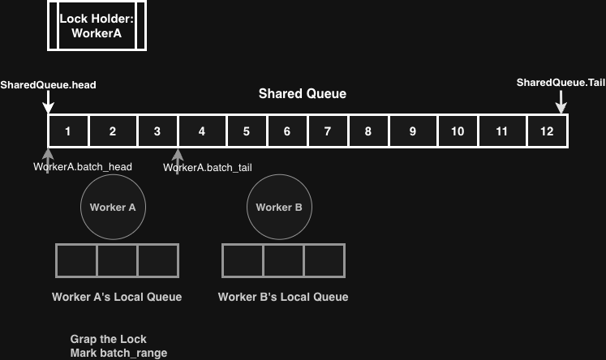
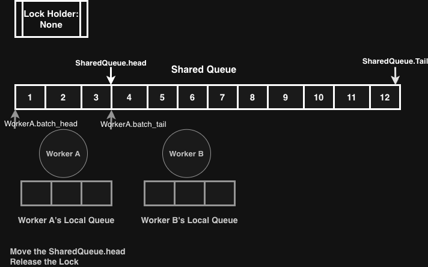
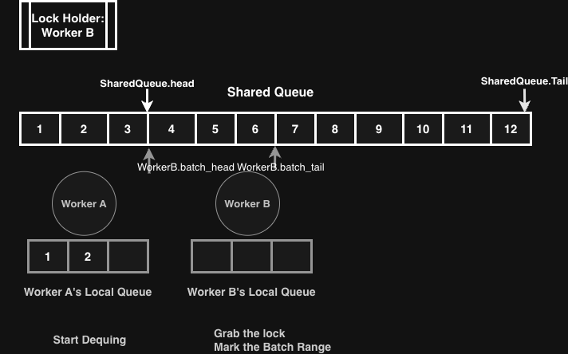

# A Shared Ring Queue with Batch Ranging Claiming.

**New York University Abu Dhabi**\
**JoonHak Kim**\
jk7296@nyu.edu\
Last Modified: _January 25, 2026_\
Keywords: ring queue, bitmap, batch dequeue, lock contention, range reservation, claim range, high throughput, consumer-friendly, worker-friendly, lock-contention.

## TL;DR:&#x20;

A shared ring queue in which multiple consumers only claim contiguous batch dequeue ranges to reduce lock contention instead of dequeuing while holding the lock. A bitmap and additional metadata are used to coordinate consumers and producers while preserving a circular, contiguous memory layout. For pseudo code, refer to the last section.

## Introduction

Ensuring safe access to a shared queue among multiple consumers has been a challenge in systems optimization. In particular, preserving sequential consistency of a queue typically requires some form of global lock and strict ordering among participants. However, doing so with moderate overhead, especially caused by lock contention, remains challenging.

Consequently, existing systems tend to adopt one of two approaches:

1. Sharded or per-consumer queues, which improve scalability, but sacrifice global ordering guarantees, or
2. A globally locked shared queue, which preserves sequential consistency but suffers from significant lock contention.

In this work, I focus on the second approach; I introduce a **Shared Ring Queue with Bitmap-Based Batched Range Claiming for Consumers.** The design aims to achieve safe concurrent access at relatively low overhead through the use of **range-marking batching** and a **bitmap-based** dequeue mechanism.

Unlike conventional shared ring queues, consumers _claim_ a contiguous range for batch dequeuing while holding the lock, but perform the actual dequeues after releasing the lock to reduce lock contention. To support this, both producers and consumers maintain additional metadata that serves as a coordination layer between enqueue and dequeue operations.

However, the design comes with an inherent trade-off as is the case with synchronization-based queue models. By amortizing fetch overhead from the shared buffer, the model allows consumers to operate under weaker assumptions and with reduced synchronization costs; however, consumers each may contribute to a producer-side illusion in which the queue appears more occupied than it actually is. The implications of this trade-off, are discussed in subsequent sections.

## Terms

**Producer**: A thread that enqueues tasks into the shared queue.

**Consumer:** A thread that dequeues tasks from the shared queue.

**Ring Queue**: A circular buffer with a fixed-size array and head/tail cursors.

**Bitmap**: A shared bit vector used to track active batch participants.

**Batching**: Fetching a contiguous range of queue slots in a single operation.

**Claiming Range:** Rather than immediately dequeuing elements, the consumer records a contiguous range of indices to be dequeued later.

**Fragmentation**: The existence of unusable gaps in the queue due to out-of-order advancement of cursors.

**Shared Queue**: A single queue concurrently accessed by either or both multiple producers and consumers.

## Design Assumptions and Pseudocode

For simplicity, I assume a queue of a single-producer among multiple consumers. While the design can be extended to support multiple producers and consumers, I do not generally recommend such configurations due to not only additional complexity in implementation but reduced performance benefits, contrary to the design goal of reducing worker overhead.

```
struct SharedRingQueue {
    Slot      buffer[N];
    uint64_t  head;
    uint64_t  tail;
    Mutex     lock;
    //Coordination layer (consumer–producer synchronization)
    uint64_t  logical_occupancy;
    Bitmap    active_batches;
    bool      batch_committed;
    uint64_t  batched_dequeue_count;
    uint64_t  committed_dequeue_count;
    Mutex     batch_commit_lock
};

struct consumer {
    uint32_t  consumer_id;
    
    uint64_t  batch_head;
    uint64_t  batch_tail;
    Slot      local_buffer[M]; //Optional, consumers don't necessarily need to
                               // copy-and paste data from the shared queue
};
```

**Coordination layer (consumer–producer synchronization):**

* **`logical_occupancy:`** The total number of slots currently considered occupied from the producer’s perspective.
* **`active_batches:`** Bitmap tracking which consumers currently have an active batch.
* **`batch_committed:`** Flag indicating that all active batches have been completed and the producer can safely consume the committed count.
* **`batched_dequeue_count:`** Counter that accumulates the total number of slots dequeued by all participating consumers during the current batch. Once the batch completes, it flushed/added to `committed_dequeue_count`
* **`committed_dequeue_count:`** Aggregated counter visible to the producer, used by the producer to advance the tail.
* The **`batch_commit_lock:`** Lock used to synchronize the updates between the producer and consumer regarding `num_occupancy` after consumers finish processing their batches.

`logical_occupancy` is used by the producer to determine the number of currently occupied slots in the queue. Unlike traditional ring queues, which calculate occupancy based on the `head` and `tail` pointers, `logical_occupancy` provides a direct representation of the queue's occupied slots for the producer. These design assumptions will be further elaborated in a later section.

**Consumer-local fields:**

* **`batch_head` / `batch_tail:`** Indices marking the start and end of the current batch in the shared queue.
* **`local_buffer:`** Local storage for fetched slots to amortize access to the shared queue.

## Mechanism

### Batching via Range-Marking

Batching is especially beneficial when the underlying memory layout is contiguous, as it improves cache spatial locality and reduces synchronization costs. However, batching typically requires some form of sequential consistency over the queue. I employed a **Bitmap-Based, Claiming-Range Batch mechanism** that allows consumers to batch dequeue operations while avoiding queue fragmentation.

However, naive batching while holding a lock still suffers due to lock contention. To mitigate this, each consumer **acquires the lock only to mark a continuous range of slots** that it will dequeue later, rather than holding the lock for the entire dequeue operation.

### Claiming-Range Batch Procedure:

1. A consumer acquires the queue lock.
2. The consumer records the current `head` of the `SharedRingQueue`.
3.  The consumer sets its local **batch range** using its `batch_head` and `batch_tail` fields:

    ```
    batch_head = shared_queue.head
    batch_tail = batch_head + batch_size
    ```
4. The consumer advances the shared queue’s `head` cursor to `batch_tail`.
5. The consumer releases the lock.

<figure><figcaption></figcaption></figure>

<figure><figcaption></figcaption></figure>

<figure><figcaption></figcaption></figure>

This approach avoids holding the lock during the actual dequeue operation; the lock is held only when marking slots. However, this naive model presents two fundamental issues:

1. **Fragmentation:** Consumers may leave unconsumed gaps in the queue if batches are not fully processed in order. If a consumer advances `SharedRingQueue.tail` prematurely without proper coordination, it can break **queue correctness**, potentially allowing producers to overwrite slots that are still in use.
2. **Producer Concurrency and Queue Correctness:** Consumers may advance `SharedRingQueue.head` and update the value of `logical_occupancy` as they mark and dequeue slots. However, a producer may attempt to enqueue new items while `logical_occupancy` has not yet been updated to reflect completed dequeues. In such cases, the producer can hold **incorrect occupancy information**, violating **queue correctness.**

## Fragmentation problem

Consider two consumers, A and B:

* Consumer A marks slots `[batch_head, batch_tail) = [0, 10)` and advances `SharedRingQueue.head` to 10.
* Consumer B marks slots `[batch_head, batch_tail) = [10, 20)` and advances `SharedRingQueue.head` to 20.

Consumer B finishes first and attempts to advance `SharedRingQueue.tail`. Since the queue is circular, it may advance the tail to 20. However, consumer A has not yet finished processing slots `[0, 10)`.

If consumer B advances `SharedRingQueue.tail` prematurely, from the producer’s perspective, slots `[0, 20)` appear free, even though consumer A may still be processing slots `[0, 10)`. This creates **fragmentation** and, more critically, **queue correctness,** potentially allowing the producer to overwrite slots that are still in use.

To prevent fragmentation caused by race conditions, I introduce a **bitmap to track active batch participants** and a **numeric batch-accumulation counter** to track cumulative dequeue progress.

Each consumer is assigned a unique index `i` corresponding to its `consumer_id`. The `SharedRingQueue` maintains:

* **`active_batches`** — a bitmap with one bit per consumer indicating whether that consumer has an active batch.
* **`batched_dequeue_count`** — an integer counter tracking the total number of slots claimed by all active batches.

When a consumer begins fetching a batch, it first sets the corresponding bit in `active_batches` according to its `consumer_id`. After marking its batch range and completing the dequeue operation, the consumer clears its bit. Since each consumer has a unique `consumer_id`, the bitmap value being zero indicates that no consumers are currently participating in batching. When all bits are cleared, it ensures that all active batching participants have finished dequeuing, and it is therefore safe to advance `SharedRingQueue.tail`. There are yet two additional issues related to this mechanism that are bitmap.value never being set to 0, and producer enqueing violating queue's correctness.

### **Bitmap-Based Dequeue Procedure**

1. Consumer acquires the lock.
2. Consumer sets its bit in `active_batches` and marks a batch range using `batch_head` and `batch_tail`.
3. Consumer releases the lock.
4. Consumer copies tasks from the shared queue into its `local_buffer` according to its batch range.
5. Consumer finishes dequeing individually then clears its bit in `active_batches`.
6. Consumer checks whether `active_batches` is now zero. If so, it advances `SharedRingQueue.tail` by the value of `batched_dequeue_count`, updates `logical_occupancy;` accordingly, and then resets `batched_dequeue_count` to zero.

### **Race Condition in Producer-Consumer Synchronization**

As mentioned in the design assumptions, the producer do not trust the `head` pointers of the queue. This is because consumers can advance the `head` without actually dequeuing, creating an illusion that the queue is more empty than it actually is. However, if consumers update `logical_occupancy`, the potential race condition between producer enqueuing and consumer batch-dequeuing could be introduced.

For example, when multiple consumers finish batching and set their bits in `active_batches` to 0. One consumer at the last then sees `active_batches` set to zero, proceeds to read `logical_occupancy` and decrement it by the value of `batched_dequeue_count`. However, before updating `logical_occupancy`, a producer might enqueue new items, changing the value of `logical_occupancy`. This causes the consumer to hold onto old values that have not been correctly updated.

A naive approach to solve this race condition would be to let the batch-dequeue and enqueue operations share a single lock. However, this introduces severe lock contention. Instead, in this design, the producer and consumers share an additional layer of coordination with a second lock, referred to as **`batch_commit_lock`**, which is used to synchronize the updates to the `logical_occupancy` between the producer and consumers.

A consumer acquires `batch_commit_lock` only when the bitmap state indicates that no valid tasks remain (i.e., `active_batches.value == 0`). Inside the critical section, the consumer sets `batch_committed` to `true` and updates `committed_dequeue_count` by adding `batched_dequeue_count`. The consumer then resets `batched_dequeue_count` to `0` and releases `batch_commit_lock`.

The producer, on the other hand, checks the value of `batch_committed` before enqueuing. If `batch_committed == true`, the producer acquires `batch_commit_lock`, reads `committed_dequeue_count`, updates `logical_occupancy -= committed_dequeue_count`, and resets `committed_dequeue_count` to 0. The producer then releases the lock.

In this way, the producer free slots with the guarantee that they do not overwrite slots that may still be in use. This design ensures that at most one consumer that observes `active_batches.value == 0` and one producer that observes `batch_committed == true` will hold `batch_commit_lock` at any given time, thereby minimizing lock contention.

### Procedure

1. **Consumer**:
   * Consumer finishes its batch and checks if `active_batches.value == 0`.
   * If `active_batches.value == 0`, the consumer acquires `batch_commit_lock`.
   * The consumer then updates `committed_dequeue_count` by adding `batched_dequeue_count` and sets `batch_committed = true`.
   * The consumer releases the `batch_commit_lock`.
2. **Producer**:
   * Before enqueuing, the producer checks if `batch_committed == true`.
   * If `batch_committed == true`, the producer acquires `batch_commit_lock`.
   * The producer then updates `logical_occupancy -= committed_dequeue_count`, resets `committed_dequeue_count = 0`, and releases `batch_commit_lock`.
   * The producer proceeds with enqueuing.

This implementation avoids most concurrency issues by separating a layer of trust and coordination responsibilities between producers and consumers. However, this itself fail on one condition in which `bitmap.value` is never set to 0 because consumers frequently batches, hardly allowing `bitmap.value` being set to 0.

## Continuous Fetching and Non-Advancing Tail

A potential issue arises when consumers continuously fetch batches such that `active_batches` rarely becomes zero. In this case, producers are under the **illusion** that the queue is more full than it actually is, while in reality many slots could remain free. This occurs because the `logical_occupancy` does not get decremented, when the bitmap is not cleared.

This issue becomes more severe when:

* The number of consumers is large.
* Fetch frequency is high.

### Possible Mitigation

Carefully scheduling fetch intervals for each consumers can reduce the probability that `active_batches` never becomes zero. Other mitigations are also possible. However, to guarantee correctness, many approaches can be considered; in this paper, I focus on maintaining a **global counter** to control the number of batching participants. Specifically, consumers are blocked when the global counter indicates that the number of consumers participating in batching has reached a certain threshold. This approach limits the number of consumers that can batch-dequeue from the shared queue. In practice, however, I believe careful scheduling of fetch intervals would be sufficient.

### Limiting Active Batch Participants

A global counter limits how many consumers may participate in batching concurrently. This counter is updated under a lock during batch requests. If the limit is reached, consumers are prevented from starting batching.

Once the bitmap becomes zero, the counter is reset, allowing consumers batching again. This guarantees that the system eventually reaches a state where the producer can update to `logical_occupancy` preventing additional consumers from participating in batching before the bitmap clears. Handling potential batching failures may be required, but this is a separate concern.

### Limiting Batch Participants Procedure

1. The shared queue maintains an additional variable `num_batch_participants`, initially set to zero.
2. A consumer requesting batching first checks `num_batch_participants`.
3. If `num_batch_participants < participant_limit`, the consumer acquires the lock.
4. Inside the critical section, the consumer checks the condition again to ensure that `num_batch_participants` remains below the limit, avoiding race conditions.
5. If it is safe to proceed, the consumer increments `num_batch_participants`.
6. If a consumer observes `active_batches.value == 0`, it updates `committed_dequeue_count`, resets `batched_dequeue_count`, and resets `num_batch_participants` to `0`.

Other correctness mechanisms are possible. However, to avoid race conditions, reading and updating `num_batch_participants` must follow a strict ordering.

## Constraints and Tradeoffs

This design significantly reduces lock contention overhead while preserving the sequential consistency of the circular queue. However, it does so by intentionally creating the illusion that the queue is more full on the producer side than it actually is.

Because this design shifts burden from consumers to the shared queue state, it performs best when:

* The number of consumers per shared queue is relatively moderate.
* Consumers do not fetch too frequently.
* Consumers tend to spend longer time processing data compare to fetching from the shared queue.

## Conclusion

Although consumers contend less frequently for locks, the queue can temporarily hold unusable slots that could, in reality, be reclaimed. The key trade-off in this design is between reducing lock contention and intentionally creating “fake-occupied” slots from the producer’s perspective.

In practical scenarios, this trade-off can be beneficial when consumers should not spend too long contending for locks and when both local buffers and queue slots are relatively small. For example, consumers may fetch small-sized data but perform heavy computation on it, such as executing predefined functions where slots only store the required arguments and function identifiers.

Additionally, because this design maintains a contiguous queue state, fetching can be faster due to reduced synchronization overheads. However, this also raises the question of how to control and maintain the fetching frequency for each consumer.

## Pseudo Code (Simplified)

```c
struct SharedRingQueue {
    Slot      buffer[N];
    uint64_t  head;
    uint64_t  tail;
    uint64_t  num_used_slots;
    Mutex     lock;
    Mutex     batch_commit_lock;
    Bitmap    active_batches;
    bool      is_committed;
    uint64_t  batch_accumulation_counter;
    uint64_t  committed_accumulation;
};

struct consumer {
    uint32_t  consumer_id;
    uint64_t  batch_head;
    uint64_t  batch_tail;
    Slot      local_buffer[M]; //Optional, consumers dont necessarily need to 
                               //copy and paste from the shared Queue.
};

void consumer_fetch(Consumer* w, SharedRingQueue*q) {
    bitmap_set(q->active_batches, w->consumer_id);

    lock(q->lock);
    w->batch_head =q->head;
    w->batch_tail =(q->head +BATCH_SIZE)% N;
    q->head = (q->head +BATCH_SIZE) %N;
    q->batch_accumulation_counter +=BATCH_SIZE;
    unlock(q->lock);

    dequeue_from_ring(q->buffer, w->local_buffer, w->batch_head, w->batch_tail);
    
    bitmap_clear(q->active_batches, w->consumer_id);
    if (bitmap_is_zero(q->active_batches)) {
        lock(q->batch_commit_lock);
        q->committed_accumulation +=q->batch_accumulation_counter;
        q->batch_accumulation_counter =0;
        q->tail =(q->tail + q->committed_accumulation) %N;
        q->is_committed =true;
        unlock(q->batch_commit_lock);
    }
}

void single_producer_enqueue(SharedRingQueue* q, Slot task){
    if (q->is_committed){
        lock(q->batch_commit_lock);
        q->tail =(q->tail + q->committed_accumulation) %N;
        q->committed_accumulation =0;
        q->is_committed =false;
        unlock(q->batch_commit_lock);
    }
    q->buffer[q->head] =task;
    q->head = (q->head +1) %N;
    q->num_used_slots +=1;
}

```
